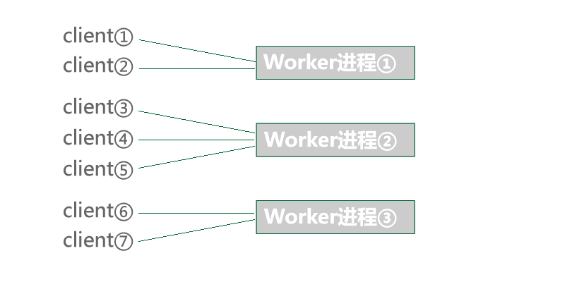
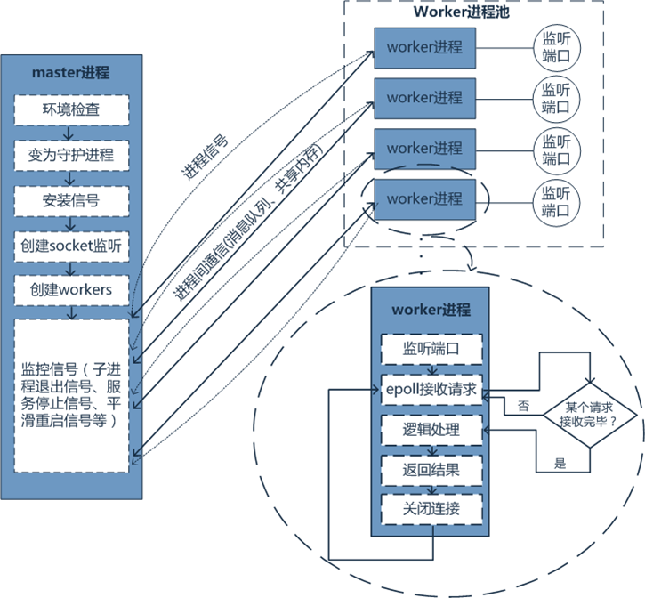

## 原理
* http://doc.workerman.net/315109

### Worker说明
* `Worker` 是WorkerMan中最基本容器，*Worker可以开启多个进程监听端口并使用特定协议通讯，类似nginx监听某个端口* 。每个Worker进程独立运作，采用 **Epoll(需要装event扩展) + 非阻塞IO**，每个Worker进程都能上万的客户端连接，并处理这些连接上发来的数据。**主进程**为了保持稳定性，只负责监控**子进程**，**不**负责接收数据也不做任何业务逻辑。

* * TODO: 所以 Worker 到底是主进程还是子进程?

### 客户端与worker进程的关系

### **主进程** 与 **worker子进程** 关系

* **特点**：
    * 从图上我们可以看出每个 `Worker` 维持着各自的 **客户端** 连接，能够方便的实现客户端与服务端的实时通讯，基于这种模型我们可以方便实现一些基本的开发需求，例如HTTP服务器、Rpc服务器、一些智能硬件实时上报数据、服务端推送数据、游戏服务器、微信小程序后台等等。
