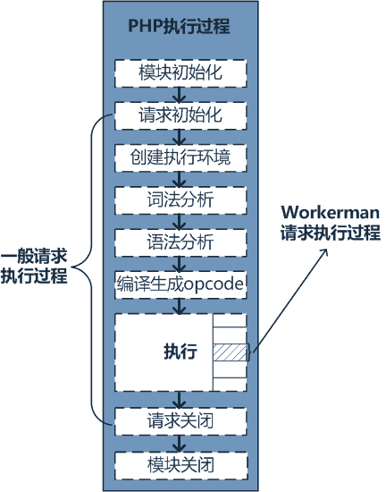
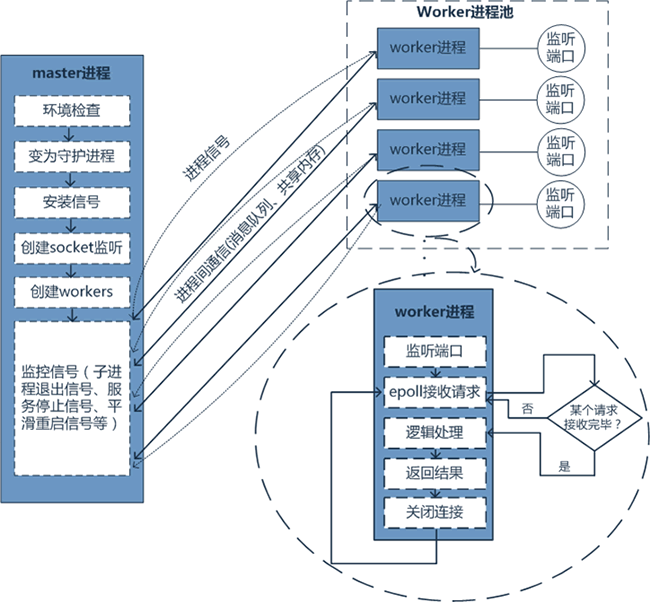

## 为什么workerman拥有卓越的性能
* http://www.workerman.net/performance

### workerman请求执行周期:

* **避免读取磁盘和反复编译**
    * workerman 运行过程中，单个进程生命周期内只要 PHP 文件被载入编译过一次，便会常驻内存，不会再去从磁盘读取或者再去编译。 **workerman省去了重复的请求初始化、创建执行环境、词法解析、语法解析、编译生成opcode以及请求关闭等** 诸多耗时的步骤。 实际上workerman运行起来后便几乎没有磁盘IO及PHP文件编译开销，剩下的只是简单的计算过程，这使得workerman运行飞快。

* **数据或者资源可以全局共享**
    * workerman中多个请求是可以共享数据或者资源的，**当前请求产生的全局变量或者类的静态成员在下一次请求中仍然有效**。 这对于减少开销，提高运行效率非常有用。例如业务只要初始化一次数据库连接，那么全局都可以共享这个连接，这实现了真正意义上的 *数据库长连接*。 从而不必每次用户请求都去创建新的连接，避免了连接时三次握手、连接后权限验证以及断开连接时四次挥手等耗时的交互过程。不仅数据库，像redis、 memcache等同样有效。少了这些开销和网络交互，使得workerman运行更快。    

* **没有多余的网络开销**
    * 传统PHP应用程序需要借助apache、nginx等容器才能对外提供网络服务，这就导致多了一层apache、nginx等容器到PHP进程的数据传输开销。 并且由于运行了apache或者nginx容器，这将进一步消耗服务器的资源。 workerman便没有这部分开销，这是由于workerman自身便是一个服务器容器具有PHP进程管理以及网络通讯功能， 完全不依赖于apache、nginx、php-fpm等这些容器便可以独立运行，所以性能更高。    

### 进程模型简单
* workerman是多进程（也有多线程版本）的，可以充分利用服务器多核资源。并且workerman具有简单的进程模型，**主进程** 只负责监控子进程，而每个 **子进程** 独自接受维护客户端的连接，独自读取连接上发来的数据，独自处理。 **子进程间** 默认没有任何数据通讯，**主进程和子进程** 之间只有一次信号通讯。简单的进程通讯模型使得workerman相比其它复杂的进程模型的软件更高效。

* 
